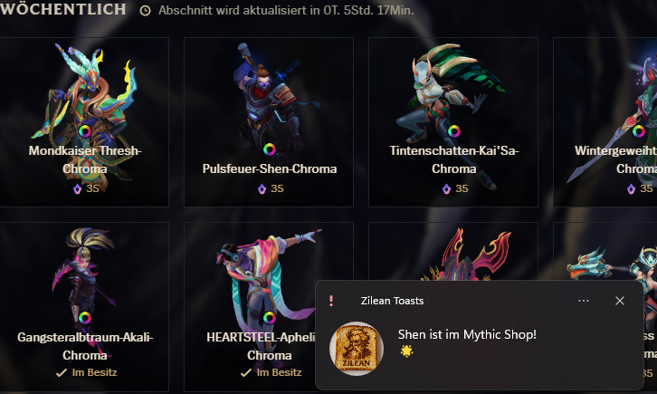
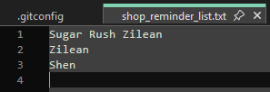
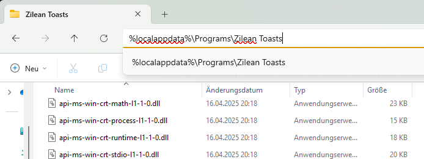

# Zilean Toasts
Zilean Toasts senden Benachrichtigungen für ausgewählte Items im Mythic Shop (vor allem für Zilean ^^).



## Reminder hinzufügen oder entfernen
Um bestimmte Skins, Emotes oder Sonstiges in die Reminder Liste aufzunehmen, kann die `shop_reminder_list.txt` Datei angepasst werden. 
Dabei gilt jede Zeile als ein Eintrag. Es müssen die englischen Bezeichnungen verwendet werden.



Die `shop_reminder_list.txt` Datei befindet sich im Installationsordner der App. Standardmäßig unter: `%localappdata%\Programs\Zilean Toasts`.




## Dev

### Python setup
```bash
pip install requests pyinstaller
```

### Bundling to an .exe
[pyinstaller](https://pyinstaller.org/en/stable/) creates an app folder in the _dist_ directory containing an .exe and all the other files needed. The _src/_ directory is completely copied over.

```bash
pyinstaller src/main.py --name "Zilean Toasts" --add-data "src/:." --icon "setup/app_icon.ico" --contents-directory "." --noconfirm --noconsole
```

### Installer
After bundling the app to an exe, [Inno Setup Compiler](https://jrsoftware.org/isdl.php) is used to create an installer. The _setup/_ directory contains an _*.iss_-File.


### Notes

Lockfile liegt hier

`"D:\Riot Games\League of Legends\lockfile"`

Format ist

`Process Name : Process ID : Port : Password : Protocol`

Basic auth bei Anfrage in Header hinzufügen:
`Authorization: Basic <base 64 encoded -> riot:password>`

Geben Mythic Shop zurück

`curl -H "Authorization: Basic <encoded>"  --insecure https://127.0.0.1:50956/lol-nacho/v1/get-active-stores`

`curl -H "Authorization: Basic <encoded>"  --insecure https://127.0.0.1:50956/lol-nacho/v1/get-active-store-catalog`

Nacho store

https://lcu.kebs.dev/#tag-Plugin%20lol-nacho

Blog
https://hextechdocs.dev/getting-started-with-the-lcu-api/


Store setzen
`curl -H "Authorization: Basic <encoded>" -H 'Content-Type: application/json'  --insecure "https://127.0.0.1:59048/lol-nacho/v1/set-active-stores/" -X POST -d '{"request": "MYTHIC_SHOP"}'`

dann abrufen

`curl -H "Authorization: Basic <encoded>" -H 'Content-Type: application/json'  --insecure "https://127.0.0.1:59048/lol-nacho/v1/get-active-stores"`
